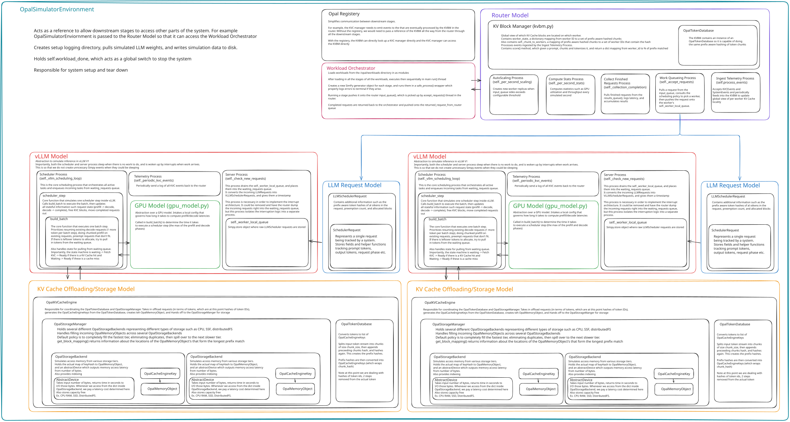

At a high level, Opal simulates the main pieces of a distributed LLM serving stack: workload generation, routing, vLLM workers, and a tiered KV cache storage.

The Workload Orchestrator generates requests and sends them to the Router. The Router (using the KV Block Manager as a global view of KV Cache state in each worker) places each request on a selected worker’s local queue. Each worker’s scheduler batches work and the GPU model accounts for prefill/decode time. Finished requests and telemetry flow back to the Router for stats and autoscaling.

**Core Abstractions**
- **OpalSimulatorEnvironment** — Handles environment setup/teardown. The Workload Orchestrator submits the workloads sequentially to the Router. The Registry acts as a way for downstream components to reference each other without needing to pass pointers through the entire request path. 
- **Router** — Picks worker node based on pluggable scheduling policy, tracks global view of KV Cache locality in the KVBM, and collects telemetry from workers.
- **vLLM_Worker** — Simulates prefill and decode of LLM requests. Each worker has its own queue, scheduler, and GPU timing model. The GPU model computes the latency for prefill and decode operations. 
- **Tiered KV Cache** — Simulates KV Cache offloading and lookup for different forms of storage (CPU, NVMe, and distributed FS). I/O latency is simulated by the AbstractDevice class.
